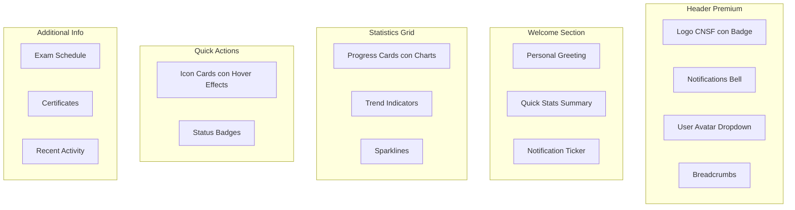

# Plan de Mejora: Dashboard Premium & Enterprise

## 🎯 Objetivo
Transformar el Dashboard actual en una interfaz **premium y enterprise** con un aspecto profesional, sofisticado y corporativo para la CNSF.

---

## 📐 Arquitectura del Nuevo Diseño



---

## 🎨 Propuestas de Diseño Premium

### 1. **Paleta de Colores Enterprise**
| Elemento | Color Actual | Color Premium |
|----------|-------------|---------------|
| Primary | `#2a5298` | `#1a365d` (Navy Deep) |
| Secondary | `#4facfe` | `#3182ce` (Royal Blue) |
| Accent | `#43e97b` | `#38a169` (Emerald) |
| Background | `#f5f7fa` | `#f8fafc` (Slate Light) |
| Cards | `#ffffff` | `#ffffff` + Shadow |
| Text | `#333333` | `#1e293b` (Slate 800) |

### 2. **Efectos Visuales Avanzados**
- **Glassmorphism** en header y overlays
- **Neumorphism** sutil en cards
- **Gradientes** modernos con blur
- **Shadows** profesionales en capas
- **Borders** con gradientes sutiles

### 3. **Nuevas Secciones**
```
Dashboard Premium Structure:
├── 🏢 Header Premium
│   ├── Logo con Shield Badge
│   ├── Notifications Bell + Badge
│   ├── User Avatar con Dropdown Menu
│   └── Breadcrumbs Navigation
│
├── 👋 Welcome Hero
│   ├── Personalized Greeting con Animation
│   ├── Quick Stats Ticker
│   └── Notification Ticker
│
├── 📊 Statistics Dashboard
│   ├── Progress Cards con Charts
│   ├── Trend Indicators (↑ ↓)
│   ├── Sparkline mini-graphics
│   └── Progress Bars animadas
│
├── ⚡ Quick Actions Enterprise
│   ├── Cards con Icon Effects
│   ├── Status Badges
│   └── Quick Links con Hover Reveal
│
└── 📋 Additional Info Panel
    ├── Exam Schedule Calendar
    ├── Certificates Section
    └── Activity Feed
```

---

## 📝 Cambios en Dashboard.tsx

### Nuevos Componentes a Agregar:

```typescript
// Imports adicionales
import { useState, useEffect } from 'react';
import { NotificationBell } from '../components/NotificationBell';
import { UserDropdown } from '../components/UserDropdown';
import { Breadcrumbs } from '../components/Breadcrumbs';
import { ProgressChart } from '../components/ProgressChart';
import { Sparkline } from '../components/Sparkline';

// Nuevos estados
const [notifications, setNotifications] = useState([]);
const [showUserMenu, setShowUserMenu] = useState(false);
const [currentTime, setCurrentTime] = useState(new Date());

// Funciones adicionales
const getGreetingByHour = () => { /* ... */ };
const handleNotificationClick = () => { /* ... */ };
const handleUserMenuToggle = () => { /* ... */ };
```

### Estructura JSX Nueva:
```jsx
<div className="dashboard-container premium">
    {/* Header Premium */}
    <header className="dashboard-header premium">
        {/* Logo con Badge */}
        <div className="brand-premium">
            <div className="logo-shield">
                <i className="fas fa-shield-alt" />
            </div>
            <div className="brand-text">
                <h1>Panel CNSF</h1>
                <span className="badge-enterprise">Enterprise</span>
            </div>
        </div>
        
        {/* Notifications */}
        <NotificationBell count={3} />
        
        {/* User Dropdown */}
        <UserDropdown user={user} onLogout={handleLogout} />
    </header>
    
    {/* Breadcrumbs */}
    <Breadcrumbs items={['Inicio', 'Dashboard']} />
    
    {/* Welcome Hero con Animación */}
    <section className="welcome-hero premium">
        <div className="hero-content">
            <h2>{getGreetingByHour()}, <span className="highlight">{getUserFirstName()}</span></h2>
            <p className="hero-subtitle">Tu progreso hacia la certificación CNSF</p>
        </div>
        <div className="hero-stats">
            {/* Mini stats ticker */}
        </div>
    </section>
    
    {/* Statistics con Charts */}
    <section className="statistics-premium">
        {/* Cards con Progress Bars */}
        {/* Sparklines */}
    </section>
    
    {/* Quick Actions Enterprise */}
    <section className="quick-actions-premium">
        {/* Cards mejoradas */}
    </section>
    
    {/* Additional Info Panel */}
    <section className="additional-premium">
        {/* Calendar, Certificates, Activity */}
    </section>
</div>
```

---

## 🎨 Cambios en Dashboard.css

### Nuevas Clases CSS:

```css
/* ===== PREMIUM VARIABLES ===== */
:root {
    --premium-navy: #1a365d;
    --premium-blue: #3182ce;
    --premium-emerald: #38a169;
    --premium-amber: #d69e2e;
    --premium-slate: #64748b;
    --premium-bg: #f8fafc;
    --premium-card: #ffffff;
    --glass-bg: rgba(255, 255, 255, 0.85);
    --glass-border: rgba(255, 255, 255, 0.3);
    --shadow-premium: 0 4px 20px rgba(0, 0, 0, 0.08);
    --shadow-elevated: 0 10px 40px rgba(0, 0, 0, 0.12);
    --radius-elegant: 12px;
    --radius-rounded: 16px;
}

/* ===== HEADER PREMIUM ===== */
.dashboard-header.premium {
    background: linear-gradient(135deg, 
        var(--premium-navy) 0%, 
        var(--premium-blue) 100%);
    padding: 24px 32px;
    border-radius: var(--radius-rounded);
    box-shadow: var(--shadow-elevated);
    backdrop-filter: blur(20px);
}

.logo-shield {
    width: 56px;
    height: 56px;
    background: rgba(255, 255, 255, 0.15);
    border-radius: 12px;
    display: flex;
    align-items: center;
    justify-content: center;
    font-size: 28px;
    color: white;
    border: 1px solid rgba(255, 255, 255, 0.2);
}

/* ===== WELCOME HERO ===== */
.welcome-hero.premium {
    background: linear-gradient(135deg, 
        var(--premium-navy) 0%, 
        #2c5282 100%);
    border-radius: var(--radius-rounded);
    padding: 32px;
    color: white;
    position: relative;
    overflow: hidden;
}

.welcome-hero.premium::before {
    content: '';
    position: absolute;
    top: -50%;
    right: -20%;
    width: 400px;
    height: 400px;
    background: radial-gradient(circle, 
        rgba(255,255,255,0.1) 0%, 
        transparent 70%);
    border-radius: 50%;
}

/* ===== STATISTICS PREMIUM ===== */
.stat-card.premium {
    background: var(--premium-card);
    border-radius: var(--radius-elegant);
    padding: 24px;
    box-shadow: var(--shadow-premium);
    border: 1px solid rgba(0, 0, 0, 0.04);
    transition: all 0.3s cubic-bezier(0.4, 0, 0.2, 1);
}

.stat-card.premium:hover {
    transform: translateY(-6px);
    box-shadow: var(--shadow-elevated);
}

/* ===== PROGRESS BARS ===== */
.progress-bar {
    height: 8px;
    background: #e2e8f0;
    border-radius: 4px;
    overflow: hidden;
}

.progress-fill {
    height: 100%;
    background: linear-gradient(90deg, 
        var(--premium-blue) 0%, 
        var(--premium-emerald) 100%);
    border-radius: 4px;
    transition: width 1s ease-out;
}

/* ===== SPARKLINES ===== */
.sparkline {
    width: 80px;
    height: 32px;
}

/* ===== QUICK ACTIONS PREMIUM ===== */
.quick-action-card.premium {
    background: var(--premium-card);
    border-radius: var(--radius-elegant);
    padding: 24px;
    box-shadow: var(--shadow-premium);
    cursor: pointer;
    transition: all 0.3s ease;
    border: 1px solid transparent;
    position: relative;
    overflow: hidden;
}

.quick-action-card.premium::after {
    content: '';
    position: absolute;
    top: 0;
    left: 0;
    width: 100%;
    height: 100%;
    background: linear-gradient(135deg, 
        transparent 0%, 
        rgba(49, 130, 206, 0.03) 100%);
    pointer-events: none;
}

.quick-action-card.premium:hover {
    border-color: var(--premium-blue);
    transform: translateY(-4px);
    box-shadow: var(--shadow-elevated);
}

/* ===== BADGES ===== */
.badge {
    display: inline-flex;
    align-items: center;
    padding: 4px 12px;
    border-radius: 20px;
    font-size: 12px;
    font-weight: 600;
}

.badge-enterprise {
    background: linear-gradient(135deg, 
        #d69e2e 0%, 
        #b7791f 100%);
    color: white;
    padding: 6px 16px;
    border-radius: 20px;
    font-size: 11px;
    font-weight: 700;
    text-transform: uppercase;
    letter-spacing: 1px;
}

/* ===== NOTIFICATIONS ===== */
.notification-badge {
    position: absolute;
    top: -4px;
    right: -4px;
    width: 20px;
    height: 20px;
    background: #e53e3e;
    border-radius: 50%;
    display: flex;
    align-items: center;
    justify-content: center;
    color: white;
    font-size: 11px;
    font-weight: 700;
}

/* ===== ANIMATIONS ===== */
@keyframes fadeInUp {
    from {
        opacity: 0;
        transform: translateY(20px);
    }
    to {
        opacity: 1;
        transform: translateY(0);
    }
}

@keyframes shimmer {
    0% {
        background-position: -200% 0;
    }
    100% {
        background-position: 200% 0;
    }
}

.animate-fade-in {
    animation: fadeInUp 0.5s ease-out forwards;
}

.animate-shimmer {
    background: linear-gradient(90deg, 
        transparent 0%, 
        rgba(255,255,255,0.4) 50%, 
        transparent 100%);
    background-size: 200% 100%;
    animation: shimmer 1.5s infinite;
}

/* ===== RESPONSIVE ===== */
@media (max-width: 768px) {
    .dashboard-header.premium {
        flex-direction: column;
        align-items: flex-start;
    }
    
    .welcome-hero.premium {
        padding: 24px;
    }
}
```

---

## 🚀 Plan de Implementación

### Fase 1: Foundation
1. ✅ Crear archivo de variables premium
2. ✅ Actualizar estructura HTML del Dashboard
3. ✅ Implementar header premium con glassmorphism

### Fase 2: Components
1. ✅ Crear componentes de Notification Bell
2. ✅ Crear componente User Dropdown
3. ✅ Implementar Progress Charts
4. ✅ Agregar Sparklines

### Fase 3: Styling
1. ✅ Aplicar gradientes enterprise
2. ✅ Implementar sombras profesionales
3. ✅ Agregar animaciones suaves
4. ✅ Mejorar tipografía

### Fase 4: Polish
1. ✅ Agregar efectos hover avanzados
2. ✅ Implementar loading states
3. ✅ Mejorar responsive design
4. ✅ Optimizar rendimiento

---

## ✅ Checklist de Entrega

- [ ] Header con logo shield y badge enterprise
- [ ] Notifications bell con badge de conteo
- [ ] User avatar con dropdown menu
- [ ] Breadcrumbs navigation
- [ ] Welcome hero con animación de saludo
- [ ] Statistics cards con progress bars
- [ ] Sparklines en estadísticas
- [ ] Quick actions con hover effects premium
- [ ] Glassmorphism effects
- [ ] Gradientes enterprise profesionales
- [ ] Animaciones suaves y fluidas
- [ ] Fully responsive design
- [ ] Loading states optimizados
- [ ] Badge "Enterprise" visible
